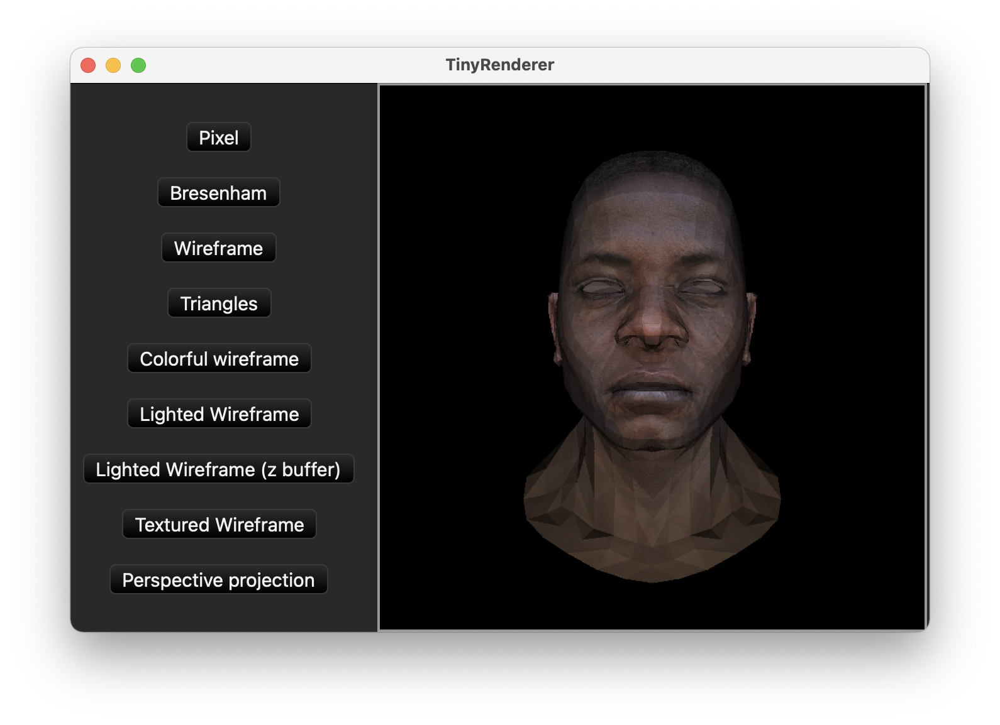

### Taking [Tiny Renderer course](https://github.com/ssloy/tinyrenderer) in Rust

- This is my very first experience with Rust. Thus, you can't learn anything from this repo apart from all mistakes I've made.
- Trying to limit number of dependencies and invent my own bicycles for the sake of learning.
- However, for more fun use [Druid](https://github.com/linebender/druid.git) as UI framework for a tiny demo app.  



Console app that generates tga images:
```shell
cargo run --bin images
```

### Some Rust WTFs
> impl for type defined outside of crate.

Can't implement protocol outside the type crate. Seems like the only workaround is to add an extra wrapper type.

---
Runtime panic for overflow. Unlike Swift, where `Int` is the default type for computation or even indexing, Rust forces you to select exact integer type.
```rust
let x: u16 = ...
let y: u16 = ...
y - x // panic, maybe
```
Also, it doesn't give you `abs` for unsigned https://github.com/rust-lang/rfcs/issues/2914.
So I decided to use `i32` for calculation in Bresenham’s Line Drawing Algorithm and then force cast :facepalm: back to `u16`.
---
Structs file serialization requires unsafe.
Maybe, I am missing something but this is super verbose and potential source of errors:
```rust
unsafe {
    let p_data: * const u8 = mem::transmute( & self.pixels[0]);
    let data = slice::from_raw_parts(
        p_data, mem::size_of::< RGBColor > () * self.pixels.len(),
    );
}
```
---
Compiler knows array size, however, it doesn't know that it is not empty: 
```rust
let non_empty_array: [V; 2] = ...
let optional_value: Option<&V> = non_empty_array.first();
```
---
There is **no** built-in pseudo random function
https://github.com/rust-random/getrandom/issues/21
---
No functions overloading
---
No built-in numeric trait
